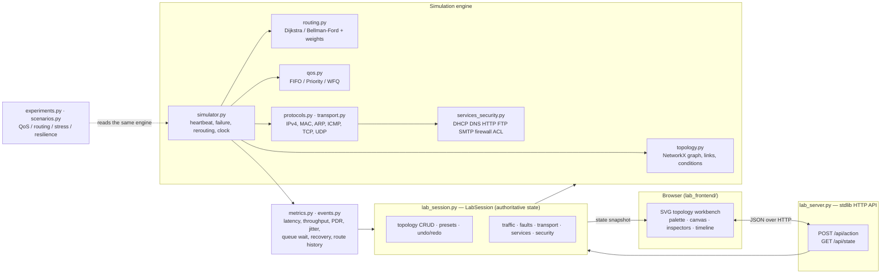
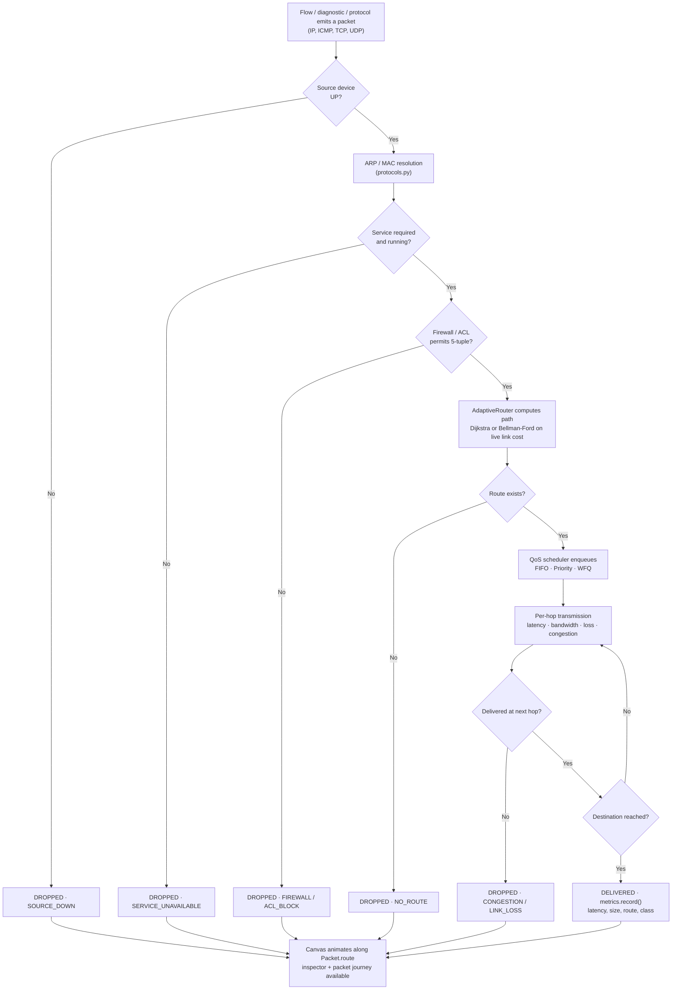
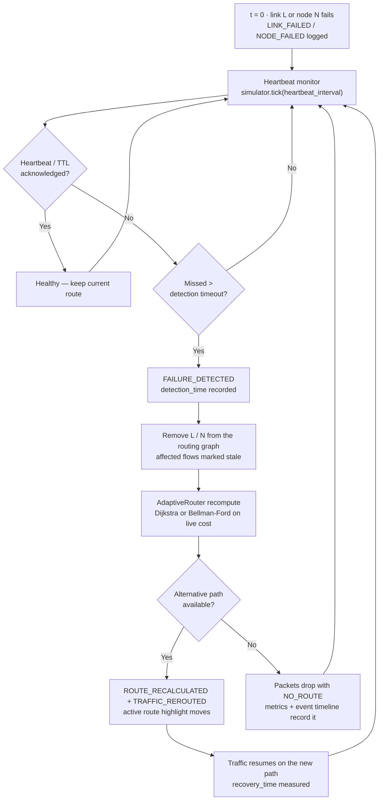
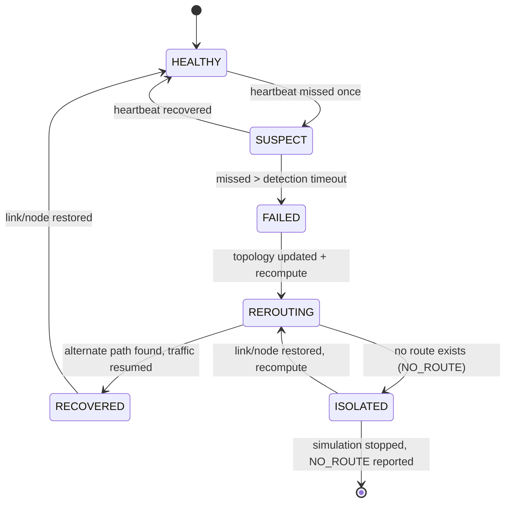
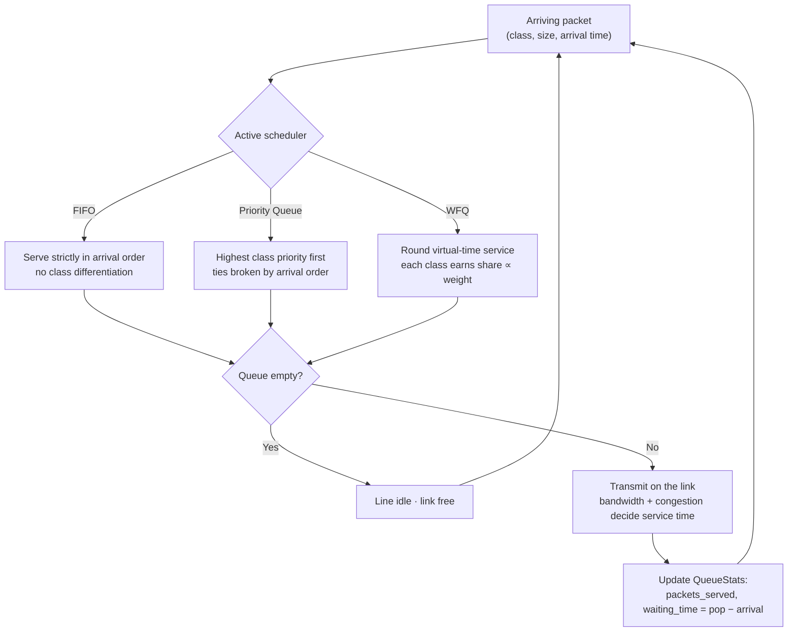
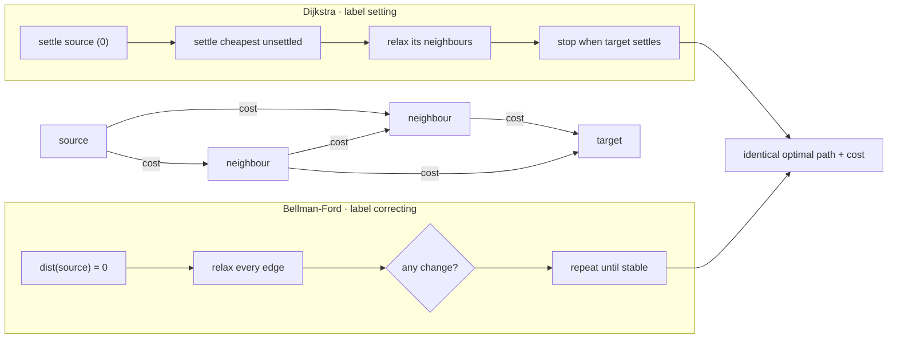
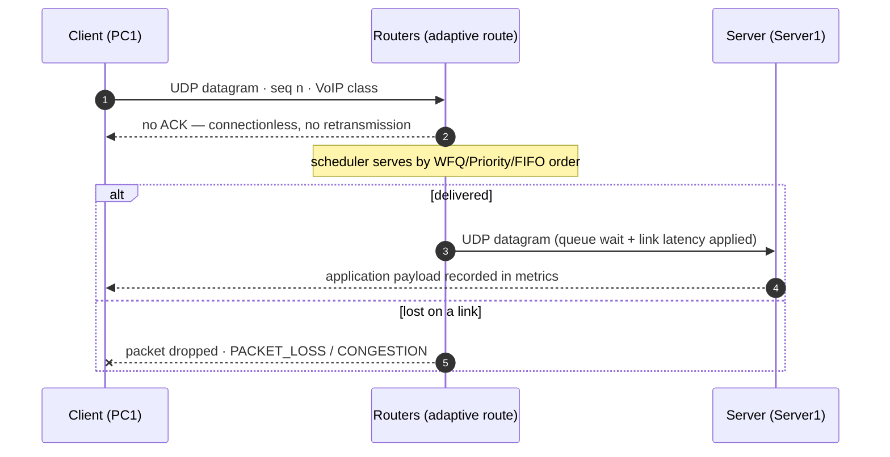
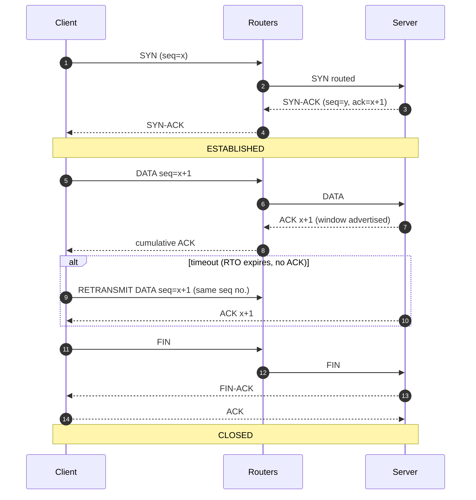
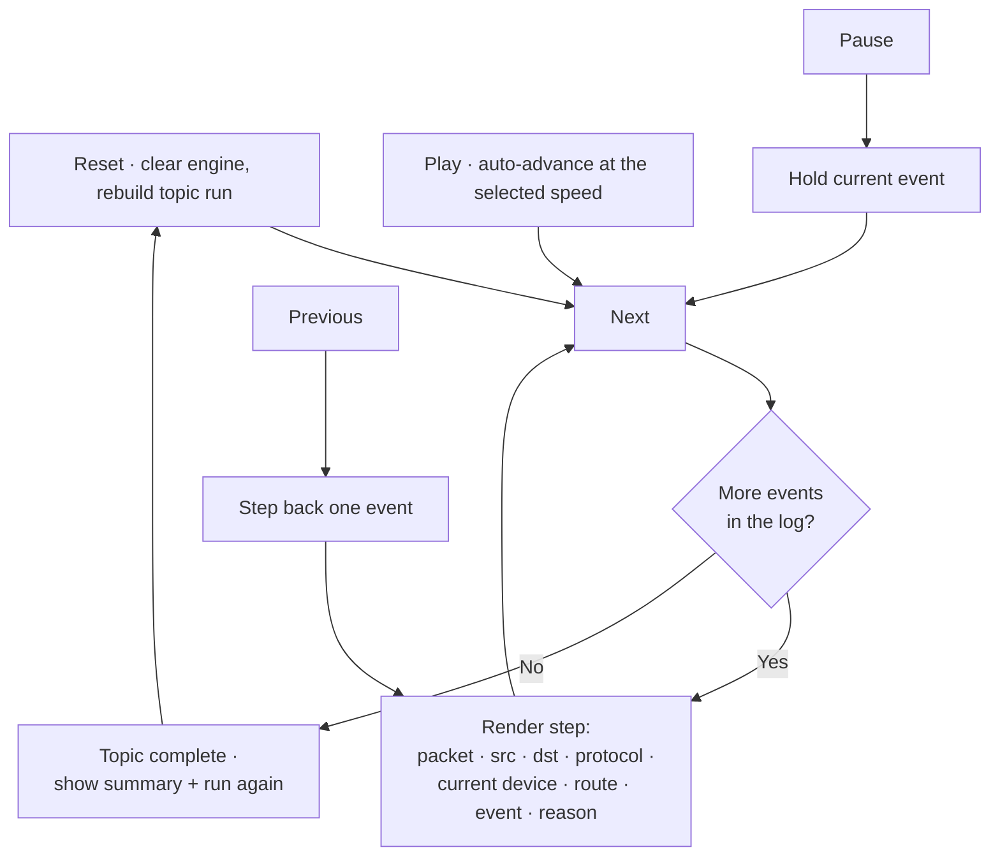

# NetAdapt — Adaptive and Self-Healing QoS-Based Network Routing System

> An interactive Computer Networks simulation system that dynamically selects routes based on network conditions, detects failures, reroutes traffic automatically, applies QoS scheduling, and analyzes network performance.


## Quick Start — Run the Lab

```bash
# 1. dependencies (once)
python -m venv .venv
.venv/bin/pip install -r requirements.txt        # Windows: .venv\Scripts\pip install -r requirements.txt

# 2. start the primary interactive network laboratory
.venv/bin/python lab_server.py --host 0.0.0.0 --port 8765

# 3. open the lab
#    http://localhost:8765/

# 4. run the complete test suite (309 tests)
.venv/bin/python -m pytest -q

# 5. optional: secondary Streamlit analytics + experiment labs
.venv/bin/streamlit run app.py
```

| Command | What it starts | URL |
|---|---|---|
| `.venv/bin/python lab_server.py --host 0.0.0.0 --port 8765` | Primary editable network laboratory (topology workbench, all labs) | **http://localhost:8765/** |
| `.venv/bin/streamlit run app.py` | Secondary analytics workspace: QoS Lab, Routing Lab, Combined Lab, Scenario Lab | http://localhost:8501 |
| `.venv/bin/python -m pytest -q` | Full test suite (309 tests, ~6 s) | — |

**The lab is served over plain HTTP — there is no HTTPS anywhere in this project.**
`lab_server.py` is a standard-library `ThreadingHTTPServer` bound to `0.0.0.0:8765`, so the browser
address is always:

```
http://localhost:8765/
```

The hosted preview link points at that same HTTP server. `https://` prefixes you may see elsewhere
(badge images in this README, for example) belong to external services such as shields.io, not to the
NetAdapt application. Nothing in the app requires TLS: there is no login, no cookie or session
state, and no secret travelling in the request path, so a certificate would add no security here. If
you ever expose the lab beyond your own machine, terminate TLS in a reverse proxy in front of port
8765 rather than modifying the server.

---

## Table of Contents

- [Quick Start — Run the Lab](#quick-start--run-the-lab)
- [Overview](#overview)
- [Primary Network Laboratory](#primary-network-laboratory--editable-topology-workbench)
- [Architecture](#architecture)
- [Core Modules](#core-modules)
- [Stage 1–3 — Core simulation, self-healing, flows, dashboard](#implemented-features-stage-23)
- [Stage 4 — Advanced QoS Laboratory](#stage-4--advanced-qos-laboratory)
- [Stage 5 — Advanced Adaptive Routing](#stage-5--advanced-adaptive-routing)
- [Combined Routing + QoS Experiment](#combined-routing--qos-experiment)
- [Stage 6 — Scenarios & Resilience](#stage-6--advanced-network-scenarios--resilience-evaluation)
- [Stage 7 — Infrastructure, ARP, ICMP](#stage-7--network-infrastructure-arp-and-icmp)
- [Stage 8A — Diagnostics & Packet Inspection](#stage-8a--network-diagnostics-and-packet-inspection)
- [Stage 9 — TCP + UDP Transport](#stage-9--tcp--udp-transport-layer-simulation)
- [Stage 10 — Services & Security](#stage-10--network-services--basic-network-security)
- [Stage 11 — Learning Mode & Evaluation](#stage-11--learning-mode-interactive-evaluation--final-polish)
- [Installation](#installation)
- [Run Application](#run-application)
- [Run Tests](#run-tests)
- [Demonstration Scenario](#demonstration-scenario-required)
- [Known Limitations](#known-limitations)

---

## Overview

Modern computer networks operate under continuously changing conditions. Traffic levels can increase, links can become congested, packet loss can occur, bandwidth can decrease, and routers or communication links can fail.

Traditional shortest-path routing may continue using a route even when its current conditions are poor.

**NetAdapt** is an interactive network simulation laboratory that demonstrates how a network can adapt to these changes:

- Monitor simulated network conditions
- Select suitable routes dynamically (Dijkstra with dynamic cost)
- Detect link/node failures via heartbeat simulation
- Automatically recalculate alternative routes
- Redirect traffic through available paths
- Simulate congestion, packet loss, bandwidth reduction
- Apply QoS scheduling (FIFO, Priority Queue, WFQ)
- Compare FIFO / Priority / WFQ on identical workloads with per-class latency, jitter, loss, PDR and queue waiting time
- Compare Dijkstra and Bellman-Ford routing, and tune route-cost weights to change actual route selection
- Run whole network scenarios (congestion, packet loss, reduced bandwidth, link/router/multiple
  failures, combined degradations) from reusable, reproducible presets
- Evaluate resilience: failure, detection, recalculation and recovery timing, packets affected and
  packets delivered after recovery
- Track route stability (the actual route history of every flow) and sweep a single network
  parameter to measure sensitivity
- Measure performance with real simulated packets
- Visualize topology, routes, failures, and performance interactively
- Operate a Packet Tracer-style SVG workspace with real packet animation, device/link inspection,
  simulation controls, live queues and an event timeline

This is a **simulation-based Computer Networks educational project**, not production router software.

## Primary Network Laboratory — Editable Topology Workbench

The primary NetAdapt experience is now a real editable network laboratory, not a fixed
analytics dashboard. Start it with:

```bash
python lab_server.py --port 8765
```

Open `http://localhost:8765`. The browser is a responsive topology editor; the
Python `LabSession` is the single source of truth for devices, links, traffic,
faults, routes, queues, protocol events, and metrics.

- **Build:** drag PC, Laptop, Server, Printer, Router, Switch, Hub, Access Point,
  Cloud, or Internet devices onto the canvas.
- **Edit:** move, rename, duplicate, delete, connect, disconnect, and configure
  devices and links. Positions snap to a grid and persist in the topology JSON.
- **Connect:** use Connect mode to create real `NetworkTopology` links with
  latency, bandwidth, packet loss, congestion, duplex, and interface metadata.
- **Configure:** edit IPv4/prefix, MAC, interface status, link conditions, routing
  algorithm and weights, plus FIFO/Priority/WFQ scheduler and per-class settings
  through the contextual inspector.
- **Simulate:** start real traffic, play/pause/step/reset, change speed, and see
  packets animate along the route returned by the Python simulator.
- **Break and heal:** fail/recover links and devices, increase congestion/loss,
  reduce bandwidth, and observe heartbeat detection, route recalculation,
  rerouting, and recovery in the bottom event timeline.
- **Inspect:** click packets, devices, cables, events, routers, switches, or use
  the real device console (`show interfaces`, `show ip route`, `show arp`,
  `ipconfig`, `ping`, and `tracert`).
- **Persist and edit history:** save/load JSON topology documents and use undo/redo
  for device, link, position, and configuration edits.
- **Scale:** the SVG canvas is designed for 50+ devices and 100+ links without
  using a frontend-only topology model.

The default document is **Self-Healing Demo**, but `New` creates a blank topology.
The legacy H1/R1 topology is available only as the `Existing Default Topology`
preset. QoS, Routing, Combined, and Scenario Labs remain available as secondary
Streamlit analysis surfaces in `app.py`.

## Secondary Streamlit Workspace

The existing Streamlit application remains available for regression and secondary
analysis. Its custom SVG workspace renders engine-backed packet traces and controls;
it is no longer the primary topology editor.

- **Real packet animation:** `STEP`, `PLAY` and `RUN ALL` call
  `NetworkSimulator.process_next_packet()`. The SVG animates the returned packet along its actual
  `Packet.route`; it does not generate independent frontend traffic.
- **Traffic classes:** Emergency, VoIP, Video, HTTP and FTP use distinct packet colours and real
  scheduler priority.
- **Simulation controls:** reset, step, play, pause, run-all, 1x/2x/5x/10x speed and simulation time.
- **Traffic generator:** source, destination, class, packet size/count/rate and SEND PACKETS.
- **Inspection:** click a packet, device or cable in the workspace, or use the lower packet/device/
  link/queue/event/metrics panels.
- **Faults and conditions:** fail/recover links and nodes; edit congestion, packet loss and bandwidth.
  A failed link advances the real simulation clock through heartbeat detection and rerouting.
- **Routing and QoS:** select Dijkstra/Bellman-Ford, edit real route-cost weights, and switch the live
  scheduler between FIFO, Priority Queue and WFQ.

The original Plotly topology, traffic controls, charts, QoS Lab, Routing Lab, Combined Lab and
Scenario Lab remain available below the workspace as secondary analysis and experiment surfaces.

---

## Architecture

```
Topology (NetworkX Graph)
   ↓
Adaptive Routing (Dijkstra / Bellman-Ford, configurable weights)
   ↓
Traffic Flows / Packets (QoS)
   ↓
QoS Scheduling (FIFO / Priority / WFQ, per-class statistics)
   ↓
Transmission (latency, bandwidth, loss, congestion)
   ↓
Metrics + Event Logging (overall + per traffic class + queue statistics)
   ↓
Experiment Engine (experiments.py: QoS / stress / routing / combined)
   ↓
Scenario Framework (scenarios.py: presets, phased runs, resilience, multi-run,
                    route stability, sensitivity, comparison, export)
   ↓
Interactive SVG Workspace (real packet/event state + inspectors)
   ↓
Editable Lab Session API (lab_session.py + lab_server.py)
   ↓
Primary topology workbench (lab_frontend/)
   ↓
Streamlit Analysis & Experiment Labs (Traffic · QoS · Routing · Combined · Scenario)
```

**Simulation Engine is Source of Truth** — UI only visualizes engine data, no fake metrics.

### System architecture



### Packet lifecycle — every animated packet follows this path



Nothing on the canvas moves unless this flow completes: a packet that the engine drops is drawn
at its source with the real drop reason (for example `NO_ROUTE`, `DESTINATION_UNREACHABLE`,
`FIREWALL_BLOCK`) instead of being animated to the destination.


### Core Modules

- `topology.py` — 10-node network (H1-H4 hosts, R1-R6 routers), link properties, UP/DOWN states, fixed layout positions
- `routing.py` — Manual **Dijkstra** and **Bellman-Ford** implementations (not `networkx.shortest_path`), selectable at runtime, dynamic cost = w_latency·latency + w_loss·loss + w_congestion·congestion + w_bandwidth·bandwidth + w_hop·hop, plus `analyze_route`/`route_info` route-condition analysis
- `qos.py` — Packet model, traffic classes (Emergency, VoIP, Video, HTTP, FTP), FIFO, PriorityQueue, WFQ with configurable priorities/weights and full queue statistics
- `experiments.py` — **Stage 4 + 5 experiment engine**: QoS scheduler comparison, congestion stress test, Dijkstra vs Bellman-Ford comparison, routing weight sensitivity, and the six-way combined experiment
- `scenarios.py` — **Stage 6 scenario framework**: named scenario presets, the phased scenario runner (before / during / after), resilience evaluation, route-stability tracking, multi-run experiments, sensitivity sweeps, scenario comparison and CSV export
- `metrics.py` — Packet tracking, latency, throughput, PDR, loss, congestion, recovery time, time-series history, before/during/after comparison
- `events.py` — Structured event system (TRAFFIC_STARTED, LINK_FAILED, FAILURE_DETECTED, ROUTE_RECALCULATED, TRAFFIC_REROUTED, etc.)
- `simulator.py` — Central engine: heartbeat monitoring, failure detection with measurable delay, automatic rerouting, active traffic flows, congestion/loss/bandwidth effects, simulation clock
- `services_security.py` — **Stage 10 service and security layer** attached to the same simulator: DHCP, DNS, HTTP, FTP, SMTP services, device service registry, stateful firewall, standard/extended ACLs, port filtering, simulated ARP spoofing and conflict detection, and controlled flood generation/detection
- `test_stage10.py` — Stage 10 acceptance tests (DHCP, DNS, HTTP, FTP, SMTP, firewall, ACL, ARP, flood, integration, CLI)
- `learning.py` — **Stage 11 learning mode**: topic catalog, real-simulation demonstrations, protocol step mode, packet journey, failure explanations
- `challenges.py` — **Stage 11 challenge mode**: broken-network challenges, rule-based evaluation, progressive hints, attempt tracking
- `quiz.py` — **Stage 11 quiz mode**: concept question bank plus questions generated from the live topology
- `demos.py` — **Stage 11 demonstration scenarios**: 18 one-click scenarios with full reset
- `report.py` — **Stage 11 overview, rule-based health, and report export** (JSON, Markdown, CSV, DataFrame)
- `test_stage11.py` — Stage 11 validation suite
- `lab_session.py` — Editable lab session: topology CRUD, presets, traffic, faults, undo/redo, JSON import/export, diagnostics, and real simulator step state
- `lab_server.py` — Dependency-free HTTP API/static server for the primary network laboratory
- `lab_frontend/` — Interactive SVG topology workbench: palette, drag/drop, connections, contextual inspectors, packet animation, queue, timeline, and console
- `app.py` — Streamlit shell: secondary network workspace plus all existing analysis/experiment labs
- `network_workspace.py` — Engine-backed SVG workspace, real packet trace stepping, inspectors, controls and secondary panels
- `scenario_lab.py` — Stage 6 "Scenario Lab" tab (rendered by `app.py`)
- `test_simulation.py` — Stage 1 tests
- `test_stage2.py` — Stage 2+3 tests (heartbeat, detection, rerouting, flows, etc.)
- `test_stage4_5.py` — Stage 4+5 tests (routing algorithms, weights, schedulers, per-class metrics, queue statistics, deterministic experiments)
- `test_stage6.py` — Stage 6 tests (scenario presets, application/reset, phased runs, resilience, route history, reproducibility, multi-run, sensitivity, comparison, export)
- `test_workspace.py` — Live workspace regression tests (real packet routes/events, drops, heartbeat rerouting, topology state, SVG motion payload)
- `test_lab.py` — Editable topology/session integration tests (CRUD, links, interfaces, faults, serialization, undo/redo, console, scale)

---

## Implemented Features (Stage 2+3)

### Self-Healing Network

- **Heartbeat / Health Check**: Simulated periodic health checks with configurable interval and detection timeout. No `time.sleep()` — uses simulation clock.
- Tracks `failure_time`, `detection_time`, `recalculation_time`, `recovery_time` with measurable delays.
- Failure detection timeout default 2.0s simulated time.

### Automatic Failure Handling

When link fails:
1. Mark link DOWN, record failure time
2. After detection timeout, emit `FAILURE_DETECTED`
3. Prevent routing through it
4. Recalculate routes for affected flows
5. Find alternative path (dynamic Dijkstra)
6. Reroute traffic, emit `ROUTE_RECALCULATED` + `TRAFFIC_REROUTED`
7. Measure detection/recovery time

When node fails: similar, removes all affected paths.

If no alternative route: traffic fails/drops appropriately, event logged, metrics reflect failure.

### Self-healing control loop



### Failure handling state machine



### Dynamic Routing Demonstration

Example:
```
Normal: H1 → R1 → R3 → R5 → H3
After R3-R5 fails: H1 → R1 → R3 → R4 → R5 → H3 (calculated, not hardcoded)
```

### Active Traffic Flows

Each flow contains:
- flow ID, source, destination, traffic type
- packet count, packet size, pps, duration
- start time, status, current route, route cost, route status
- packets sent/delivered/dropped
- detection/recovery times

Supports multiple simultaneous flows (e.g., H1→H3 Video, H2→H4 HTTP, H3→H1 VoIP).

### Dynamic Traffic Generation

- One-time bursts and continuous traffic
- Configurable packets/sec, packet size, duration
- Multiple simultaneous flows
- Creates actual Packet objects through simulation pipeline

### Congestion Simulation

- Congestion influences route cost, route selection, transmission latency, packet loss, metrics
- Example: congestion on R1-R3 increases cost, router may select alternative path if cheaper
- Transmission time = (latency * congestion_factor) + (serialization * congestion_factor)

### Packet-Loss Injection

- User can increase loss probability on selected links
- Affects actual packet delivery via `_packet_loss_probability`
- Effective loss = packet_loss + congestion*0.05
- Metrics reflect real simulation

### Bandwidth Reduction

- User can reduce bandwidth on selected link (e.g., 100 Mbps → 20 Mbps)
- Influences actual transmission time: serialization = size_bytes / (bandwidth_Mbps * 125000)
- Correct unit conversions, not just label change

### Simulation Clock

- Tracks current simulation time, packet creation/delivery times, failure/detection/recalculation/recovery times
- Runs quickly without real-time sleeping
- `tick(delta)` advances clock and checks heartbeats

### Event System

Structured events with timestamp, type, component, flow, message:

```
TRAFFIC_STARTED, PACKET_SENT, PACKET_DELIVERED, PACKET_DROPPED,
LINK_FAILED, NODE_FAILED, FAILURE_DETECTED, ROUTE_RECALCULATED,
TRAFFIC_REROUTED, LINK_RECOVERED, NODE_RECOVERED,
CONGESTION_CHANGED, PACKET_LOSS_CHANGED, BANDWIDTH_CHANGED
```

### Metrics

- Average latency, throughput, packet loss, PDR, congestion
- Packets sent/delivered/dropped, active flows
- Failure detection time, route recalculation time, recovery time
- Time-series history, CSV export, before/during/after comparison

### Streamlit Dashboard — *Network & Traffic* tab (Stage 2+3)

**Header**: Title + description

**Network Status**: total/active nodes/links, active flows, sim time

**Network Topology**: Real visual graph from NetworkX (Plotly), fixed layout:
- Hosts (square) vs Routers (circle)
- Active/inactive nodes/links visually distinct (red for failed, green for active route, orange for congested)
- Selected route highlighted
- Hover details for latency, bandwidth, loss, congestion

**Traffic Control**: Source, Destination, Traffic Type, Packet Count, Packet Size, Packets/sec, Duration + Generate Traffic, Run Simulation, Tick, Reset

**Fault Injection**: Select link/node, Fail/Recover Link/Node, Increase Congestion, Increase Packet Loss, Reduce Bandwidth, Reset Conditions

**Active Route**: Source, Destination, Current route, Cost, Status (HEALTHY/REROUTED/FAILED)

**Live Metrics**: Cards for Latency, Throughput, Loss, PDR, Congestion, Recovery Time

**Performance Graphs**: Plotly time-series for latency, throughput, loss, PDR, congestion + before/during/after comparison

**Event Log**: Recent events with simulation timestamps

**Session State**: Simulator persists between reruns, reset creates clean state

---

## Stage 4 — Advanced QoS Laboratory

### Schedulers

| Scheduler | Ordering rule |
|---|---|
| **FIFO** | Arrival order, traffic classes are not differentiated |
| **Priority Queue** | Strict class priority, ties broken by arrival order |
| **WFQ** | Per-class service credits: long-run service share converges to the configured class weight, no class starves |

Traffic classes: **Emergency, VoIP, Video, HTTP, FTP**.



Long-run service share of a WFQ class converges to its configured weight, so no class starves —
which is exactly what the priority scheduler trades away.


### Configurable priorities and weights

- `configure_priorities({...})` changes the scheduling priority of each traffic class (new packets pick it up immediately, so Priority Queue ordering genuinely changes).
- `WFQ(weights={...})` / `set_weights({...})` set per-class service weights — weights are validated (positive, known classes only).
- Both are configurable from the dashboard (**QoS Lab → Traffic-class configuration**) and are passed into experiments.

### Per-class QoS metrics (from real packet records)

`Metrics.class_metrics()` aggregates the packet records of every traffic class:

- packets sent / delivered / dropped
- average latency
- **jitter** (RFC 3550 style mean absolute consecutive latency difference)
- throughput
- packet loss (%)
- packet delivery ratio (%)
- **average and maximum queue waiting time**

### Queue statistics

Every scheduler is instrumented identically (`QueueStats`, `queue_statistics()`, `class_statistics()`):

- current queue length, maximum queue length
- packets enqueued, packets served
- total / average / maximum waiting time
- per-class enqueue, serve and occupancy counters

Waiting time is measured with the simulation clock: a packet records its arrival time when it is
enqueued and the scheduler reports `pop_time − arrival_time` when it is served, so waiting times
emerge from real congestion instead of being assumed.

### QoS experiments (`experiments.py`)

- `run_qos_experiment(...)` — runs the **same workload on the same network conditions** through FIFO, Priority Queue and WFQ, then reports the actual results per scheduler, per class and per queue.
- `run_qos_stress_test(...)` — congestion stress test (90% congestion, 5% loss, 25 Mbps) where all five classes compete. Delivery is identical across schedulers because the loss realisation is pre-drawn per packet, which isolates the scheduler effect on latency, jitter and waiting time.

The workload is emitted round-robin per traffic class **in arrival order**, so FIFO is a true
arrival-order queue and all classes genuinely compete at the same time.

---

## Stage 5 — Advanced Adaptive Routing

### Algorithms

- **Dijkstra** — label-setting with a binary heap (`settled_nodes`, `relaxations` reported).
- **Bellman-Ford** — label-correcting edge relaxation with early exit and negative-cycle detection (`iterations`, `relaxations` reported).

Both run on the same `NetworkTopology` and the same dynamic link cost, and both are selectable at
runtime (`AdaptiveRouter(algorithm=...)`, `set_algorithm(...)`, dashboard control, `sim.set_router_algorithm(...)`).

#### Dijkstra (label setting, binary heap)

```text
function shortest_path(graph, source, target, cost(u, v)):
    dist   = {source: 0, others: +inf}
    parent = {}
    heap   = [(0, source)]
    settled = {}
    while heap not empty:
        (d, u) = heap.pop_min()
        if u in settled: continue
        settled.add(u); settled_nodes += 1
        if u == target: break
        for each neighbour v of u on an UP link:
            if v in settled: continue
            alt = d + cost(u, v)          # live latency/loss/congestion/bandwidth/hop
            if alt < dist[v]:             # relax
                dist[v] = alt; parent[v] = u
                heap.push((alt, v)); relaxations += 1
    if dist[target] == +inf: return NO_ROUTE
    return path(target)
```

#### Bellman-Ford (label correcting, early exit)

```text
function shortest_path(graph, source, target, cost):
    dist   = {source: 0, others: +inf}
    parent = {}
    repeat:
        changed = false
        for each edge (u, v) on UP links:
            if dist[u] + cost(u, v) < dist[v]:
                dist[v] = dist[u] + cost(u, v); parent[v] = u
                changed = true; relaxations += 1
        iterations += 1
    until not changed or iterations == |V| - 1
    # a further improving pass would mean a negative cycle
    if any edge still improves: report NEGATIVE_CYCLE
    return path(target)
```

| Property | Dijkstra | Bellman-Ford |
|---|---|---|
| Strategy | label setting (finalises a node once) | label correcting (revisits until stable) |
| Complexity | O((V + E) log V) | O(V · E) |
| Negative weights | not supported | supported (detects negative cycles) |
| Extra state | min-heap | parent/dist table |
| Reported work | `settled_nodes`, `relaxations` | `iterations`, `relaxations` |
| Route selected in this project | identical optimal path | identical optimal path |



The agreement between the two independent implementations on every source/destination pair is the
cross-check that the routing layer is correct, and it is asserted in
`test_stage4_5.py::test_routing_experiment_dijkstra_vs_bellman_ford_and_deterministic`.


### Configurable route-cost weights

```
cost = w_latency · latency
     + w_loss · loss · 100
     + w_congestion · congestion · 100
     + w_bandwidth · (100 / bandwidth)
     + w_hop
```

Weights are read on every link-cost evaluation, so changing them immediately changes the route the
engine selects (completed flows in the live simulator are re-evaluated as well). Measured example
(`run_routing_weight_experiment`, degraded core: 60% congestion and 35% loss on R1-R3/R3-R5,
10 Mbps on R2-R4/R4-R5):

| Weight configuration | Route selected by the engine | Hops |
|---|---|---|
| Balanced (default) | H1 → R1 → R2 → R4 → R5 → H3 | 5 |
| Hop-minimising (`hop=1`, all others 0) | H1 → R1 → R3 → R5 → H3 | 4 |
| Latency-optimised | H1 → R1 → R3 → R5 → H3 | 4 |
| Loss-avoiding | H1 → R1 → R2 → R4 → R5 → H3 | 5 |
| Congestion-avoiding | H1 → R1 → R2 → R4 → R5 → H3 | 5 |
| Bandwidth-optimised | H1 → R1 → R3 → R5 → H3 | 4 |

The condition-aware configurations divert away from the congested/lossy links, while
hop/latency/bandwidth-only configurations take the short path regardless of degradation — the route
change is produced by the routing engine, not by the UI.

### Route analysis and routing experiments

`AdaptiveRouter.analyze_route(topology, path)` / `route_info(...)` report the selected route, route
cost, hop count, summed path latency, end-to-end packet loss, mean congestion and bottleneck
bandwidth. `experiments.run_routing_comparison(...)` runs the same workload with Dijkstra and
Bellman-Ford and compares all of the above plus the algorithmic work performed
(relaxations, iterations, nodes visited).

Both algorithms agree on the selected route and on the optimal cost for every source/destination
pair — an independent cross-check that both implementations are correct.

---

## Combined Routing + QoS Experiment

`experiments.run_combined_experiment(...)` runs all six configurations on the **same topology, same
workload, same network conditions and same seed**:

1. Dijkstra + FIFO
2. Dijkstra + Priority Queue
3. Dijkstra + WFQ
4. Bellman-Ford + FIFO
5. Bellman-Ford + Priority Queue
6. Bellman-Ford + WFQ

Reported comparisons (all read back from the simulation): latency, throughput, packet loss, PDR,
jitter, route cost and hop count, plus queue statistics and per-class tables for every configuration.

Because both routing algorithms find the same optimum, each scheduler's results are reproduced by
both algorithms, which isolates the QoS scheduler as the variable that changes per-class behaviour.

---

# Stage 6 — Advanced Network Scenarios & Resilience Evaluation

The Stage 6 layer (`scenarios.py`) makes the engine able to evaluate realistic network situations
**systematically** instead of configuring every experiment by hand.

## 1. Scenario Framework

A scenario is a reproducible description of a network situation. `ScenarioPreset` holds:

| Field | Meaning |
|---|---|
| `name` / `description` | human-readable scenario identity |
| `conditions` | the exact link conditions (congestion, packet loss, bandwidth) applied to named links |
| `failures` | the links and nodes that go down during the run, and are later recovered |
| `workload` | the traffic workload (classes, packets per class, packet size, pps, seed) |
| `seed`, `failure_detection_timeout` | deterministic seed and detection timeout |
| `before_fraction`, `during_fraction` | how much of the workload runs before / during the outage |

`apply_scenario(sim, scenario)` applies a preset to a live simulator (resetting the topology to its
defaults first, so a scenario never inherits the previous one's degradation), and
`reset_scenario(sim)` / `clear_failures(sim)` return the network to its default state.

## 2. Scenario Presets

| Key | Scenario | Conditions | Failures |
|---|---|---|---|
| `normal` | Normal network | none (topology defaults) | — |
| `high_congestion` | High congestion | 75% congestion on all core links | — |
| `high_packet_loss` | High packet loss | 10% loss on all core links | — |
| `reduced_bandwidth` | Reduced bandwidth | 10 Mbps on all core links, bulk (8000 B) packets | — |
| `link_failure` | Link failure | topology defaults | R3-R5 |
| `router_failure` | Router (node) failure | topology defaults | node R3 |
| `multiple_link_failures` | Multiple link failures | topology defaults | R3-R5 and R4-R5 |
| `congestion_and_failure` | Congestion + link failure | 75% congestion | R3-R5 |
| `loss_and_congestion` | Packet loss + congestion | 60% congestion + 12% loss | — |
| `bandwidth_degradation_and_congestion` | Bandwidth degradation + congestion | 15 Mbps + 60% congestion | — |
| `combined_degraded_network` | Combined degraded network | two condition groups: congestion 50% + loss 8% + 20 Mbps, and 50% congestion + 40% loss on R1-R3/R3-R5 | R3-R5 and R4-R5 |

Failures are injected mid-run and recovered later, so every failure scenario produces a real
before / during / after measurement rather than a single snapshot.

## 3. Phased Scenario Execution

`run_scenario(...)` drives the real `NetworkSimulator` through three phases:

1. **before** — the workload runs on the scenario's conditions,
2. **during** — the scenario's components fail, the simulation clock advances past the detection
   timeout so the heartbeat engine *detects, recalculates and reroutes*, and more of the workload
   is processed,
3. **after** — the failed components recover and the remaining workload is drained.

Each phase's metrics are computed by the same `Metrics` implementation used everywhere else, applied
to that phase's packet records, so latency, throughput, loss, PDR and jitter are real per-phase
measurements.

## 4. Resilience Evaluation

For one run the engine records (all measured, never estimated):

- failure time, detection time and detection delay,
- route recalculation time and recalculation delay,
- recovery time and outage time (failure → restored),
- packets processed during the outage ("affected"), delivered and dropped,
- packets successfully delivered after recovery,
- number of route changes, failed components, initial route and final route.

Timing comes from the simulator's `RecoveryRecord`s (the same records Stage 2+3 uses), and the packet
counts come from the packet records created in each phase.

## 5. Route Stability

Every route decision is already logged as structured events, so Stage 6 reconstructs the actual
route history from them:

- `route_history_frame(sim)` — one row per initial route and per `ROUTE_RECALCULATED` event, with the
  previous route, the new route and the route cost.
- `flow_route_history(sim)` — the route history of each individual flow.
- `workload_route_timeline(sim, flow_ids)` — the workload's route over time with repeated routes
  collapsed; the number of route changes is the length of that timeline minus one.

Measured example (`link_failure`, seed 42, 50 packets):

```
Before failure : H1 → R1 → R3 → R5 → H3
During failure : H1 → R1 → R2 → R4 → R5 → H3
After recovery : H1 → R1 → R3 → R5 → H3
```

Detection delay 1.50 s, outage 2.14 s, 2 route changes, 100% of packets delivered.
`multiple_link_failures` (R3-R5 **and** R4-R5 down) detours through
`H1 → R1 → R2 → R4 → R6 → R5 → H3` and returns to the optimal route after recovery.

## 6. Multi-Run Experiments

`run_multi_run_experiment(scenario, seeds=[...])` executes the same scenario with several seeds and
reports, for every metric: **mean, standard deviation, minimum and maximum** (plus the per-run
table). The metrics covered are average latency, latency standard deviation, throughput, packet
loss, PDR, jitter, average queue waiting time, maximum queue length, recovery time, route changes,
successful flows, failed/dropped flows and packets affected.

## 7. Sensitivity Experiment

`run_sensitivity_experiment(parameter, values)` varies **one** network parameter while every other
condition stays identical (the varied parameter is applied uniformly to all links the workload uses,
so routing cannot escape it):

| Parameter | Default sweep |
|---|---|
| `congestion` | 0.0 → 0.2 → 0.4 → 0.6 → 0.8 → 1.0 |
| `packet_loss` | 0 % → 5 % → 10 % → 20 % |
| `bandwidth` | 100 → 50 → 25 → 10 Mbps |

Measured example (mean of seeds 42 and 7, 50 packets), congestion sweep:

| Congestion | Avg latency (ms) | PDR (%) | Throughput (B/s) | Avg queue wait (ms) |
|---|---|---|---|---|
| 0.0 | 541.0 | 100.0 | 29679 | 500.6 |
| 0.2 | 982.3 | 95.0 | 20140 | 896.8 |
| 0.4 | 1424.3 | 88.0 | 14510 | 1293.1 |
| 0.6 | 1846.9 | 82.0 | 11062 | 1689.3 |
| 0.8 | 2292.3 | 79.0 | 9018 | 2085.5 |
| 1.0 | 2759.5 | 76.0 | 7519 | 2481.8 |

## 8. Scenario Comparison

`compare_scenarios([...])` measures several scenarios on the **same workload and the same seed**.
Only the scenario definition differs between rows. Measured example
(50 packets, seed 42):

| Scenario | Avg latency (ms) | PDR (%) | Loss (%) | Outage (s) | Route changes | Final route |
|---|---|---|---|---|---|---|
| Normal network | 541.0 | 100.0 | 0.0 | 0.00 | 0 | H1 → R1 → R3 → R5 → H3 |
| High congestion | 2113.9 | 80.0 | 20.0 | 0.00 | 0 | H1 → R1 → R3 → R5 → H3 |
| Link failure | 1547.0 | 100.0 | 0.0 | 2.14 | 2 | H1 → R1 → R3 → R5 → H3 |
| Combined degraded network | 2838.9 | 40.0 | 60.0 | 3.00 | 2 | H1 → R1 → R3 → R4 → R5 → H3 |

## 9. Reproducibility

Same topology + same conditions + same workload + same seed + same configuration produces the same
simulation result. This is what makes every comparison fair, and it is covered by dedicated tests:
repeating a scenario run returns identical summary rows, phase metrics, route history, route
timeline and per-class tables, and repeating a multi-run experiment with the same seed three times
reports a standard deviation of exactly zero for every metric.

## 10. Export

Every result object exposes `frames() -> {name: DataFrame}`, and
`export_frames(frames, directory)` / `export_result(result, directory)` write those DataFrames to CSV
files. The Scenario Lab additionally offers CSV download buttons for the scenario summary, the route
history, the per-run results, the sensitivity results and the scenario comparison. Exported content
is the generated experiment data, not hand-written values.

---

## Dashboard Tabs (Stage 4 + 5 + 6)

| Tab | Contents |
|---|---|
| **🛰️ Network & Traffic** | Stage 1-3 simulation: traffic generation, fault injection, condition injection, topology view, active route, live metrics, live queue statistics, performance graphs, per-class QoS of the live simulation, event log |
| **🧪 QoS Lab** | Scheduler selection (live + experiment), traffic-class priority/WFQ weight configuration, workload and scenario selection, FIFO vs Priority vs WFQ comparison, congestion stress test, per-class latency/throughput/loss/jitter/waiting-time charts, queue statistics, per-class queue occupancy |
| **🧭 Routing Lab** | Live algorithm selection, routing weight configuration (with presets), Dijkstra vs Bellman-Ford comparison, routing weight sensitivity experiment, route/route-cost/hop-count tables and charts, selected route drawn on the topology, per-class metrics per algorithm |
| **🔬 Combined Lab** | Six-way routing × QoS comparison with six charts (latency, throughput, loss, PDR, jitter, route cost), route/cost/hop table, class-wise comparison across all six configurations, queue statistics per configuration |
| **🧨 Scenario Lab** | Scenario preset selection, full scenario run with per-phase tables/charts and the resilience table, route history + route-over-time chart + final route on the topology, multi-seed repeated experiments with aggregate statistics, parameter sensitivity analysis with charts, scenario comparison, and CSV download buttons |

All experiment runs use deterministic seeds and report the workload, seed and conditions alongside
the results so each comparison is reproducible. The Stage 6 UI is additive only — the existing tabs
were not redesigned.

---

## Installation

```bash
python -m venv venv

# Windows
venv\Scripts\activate

# Linux/Mac
source venv/bin/activate

pip install -r requirements.txt
```

Dependencies:
- networkx>=3.2
- numpy>=1.26
- pandas>=2.0
- streamlit>=1.37
- plotly>=5.20
- pytest>=8.0

## Run Application

Primary editable network laboratory (this is the main app):

```bash
# macOS / Linux
.venv/bin/python lab_server.py --host 0.0.0.0 --port 8765

# Windows
.venv\Scripts\python lab_server.py --host 0.0.0.0 --port 8765
```

Open **http://localhost:8765/**

Secondary Streamlit analytics and experiment labs:

```bash
.venv/bin/streamlit run app.py     # http://localhost:8501
```

Both processes can run at the same time. If port 8765 is busy, stop the other
process or start on a free port:

```bash
.venv/bin/python lab_server.py --port 9000   # then open http://localhost:9000/
```

Health check without opening a browser:

```bash
curl -s http://localhost:8765/api/state | head -c 200
```

## Run Tests

```bash
.venv/bin/python -m pytest -q
```

Expected: **309 passed** — engine, scenarios, workspace, transport, services and
security, learning mode, and editable-lab integration tests.

```bash
.venv/bin/python -m pytest test_stage6.py -v      # Stage 6 scenarios only
.venv/bin/python -m pytest test_stage4_5.py -v    # QoS + routing only
.venv/bin/python -m pytest test_lab.py -v         # editable lab / session only
.venv/bin/python -m pytest test_stage11.py -v     # learning / evaluation only
```

## Demonstration Scenario (Required)

This workflow must work through UI:

1. **Open NetAdapt**: `streamlit run app.py`
2. **Observe the live SVG workspace**: PC/router icons, cables, conditions, queue and active route
3. **Configure traffic**: PC1 → PC3, Video, 20 packets, 1500 bytes, 10 packets/sec
4. **Click SEND PACKETS**: queued packets appear at PC1 and automatic playback starts
5. **Use STEP / PLAY / PAUSE / RUN ALL**: every packet follows the route returned by the engine
6. **Inspect a packet/device/link**: click its marker, icon or cable in the workspace
7. **Introduce congestion**: select R1-R3 and apply a high congestion value; cable and route react
8. **Fail R3-R5**: the cable turns red, heartbeat time advances, and the Events panel records failure/detection/recalculation/rerouting
9. **Continue playback**: new packets use the actual recalculated route
10. **Inject loss or change scheduler**: dropped packets show an X; queue occupancy follows the selected scheduler
11. **Switch routing algorithm or weights**: the highlighted route is recalculated by the real router
12. **Recover the link**: the engine records recovery and may return to a cheaper route
13. **Open the lower labs**: QoS, Routing, Combined and Scenario analytics remain available

All steps use real simulation engine, no hardcoded routes or fake metrics.

## Demonstration Scenario (Stage 6 — Scenario Lab)

1. **Open the `🧨 Scenario Lab` tab**
2. **Select a preset**: `High congestion`, `Link failure`, `Multiple link failures`, `Combined degraded network`, …
3. **Press `▶️ Run scenario`**: the workload runs *before* the failure, the failure is injected, the
   clock advances past the detection timeout so the engine detects and reroutes, then the network
   recovers and the rest of the workload is drained
4. **Observe** the per-phase table and chart, the resilience/recovery measurements, the route
   history table, the route-over-time chart and the final route drawn on the topology
5. **Press `🔁 Run repeated experiments`** with seeds `1, 2, 3, 4, 5` to get per-run results plus
   mean / standard deviation / min / max for every metric
6. **Press `📈 Run sensitivity analysis`** and switch the parameter between congestion, packet loss
   and bandwidth to see measured performance degrade monotonically
7. **Press `⚖️ Compare scenarios`** to measure the selected scenarios on the same workload and seed
8. **Download** the summary, route history, per-run, sensitivity or comparison tables as CSV

## Code Quality

- Type hints throughout
- Clean modular design, no duplicated logic
- Docstrings for public methods
- Deterministic random seed support
- No hardcoded routes, no fake metrics, no UI-only simulation logic
- Preserves Stage 1 architecture

## Definition of Done — Stage 4 + 5 Checklist

- [x] FIFO, Priority Queue and WFQ available and selectable
- [x] Configurable traffic-class priorities (Priority Queue)
- [x] Configurable WFQ service weights
- [x] Per-class metrics: latency, throughput, packet loss, PDR, jitter, queue waiting time
- [x] Queue statistics: current length, maximum length, packets served, waiting time
- [x] Per-class queue occupancy and enqueue/serve counters
- [x] QoS comparison experiment on one identical workload and set of conditions
- [x] QoS congestion stress test with all five classes competing
- [x] Dijkstra implemented and validated
- [x] Bellman-Ford implemented and validated
- [x] Dijkstra and Bellman-Ford agree on optimal cost (cross-check)
- [x] Routing algorithm selectable at runtime (engine + dashboard)
- [x] Configurable routing weights: latency, packet loss, congestion, bandwidth, hop count
- [x] Routing weight changes alter the selected route on real conditions
- [x] Routing comparison experiment (route, cost, hops, latency, loss, congestion)
- [x] Routing weight sensitivity experiment
- [x] Six-way combined routing x QoS experiment (same workload, conditions, seed)
- [x] QoS Lab, Routing Lab and Combined Lab dashboard tabs with tables and charts
- [x] All displayed values produced by the simulation engine, no hardcoded results
- [x] Deterministic seeded experiments
- [x] Stage 1-3 tests still pass (36) and 23 Stage 4+5 tests added (59 total)
- [x] README documents Stage 4 + 5

## Stage 7 — Network Infrastructure, ARP, and ICMP

Stage 7 adds an educational network-infrastructure layer without replacing the
existing graph, simulator, routing, QoS, event, metrics, or Scenario Lab code.

### Devices and interfaces

- `devices.py` provides `Device`, `NetworkInterface` (also exported as
  `Interface`), `Switch`, and `RoutingTable`.
- Existing `H*` nodes remain hosts and `R*` nodes remain routers. Custom
  `pc`, `switch`, and `server` nodes can be added to `NetworkTopology` with
  `add_node(name, type)` and then connected with `add_link`.
- Every default node receives deterministic MAC and IPv4 interface metadata.
  Interfaces expose their link associations and `UP`/`DOWN` state.
- The graph remains the source of truth for routing and failure injection;
  device/interface status is synchronized with the graph.

### IPv4 and subnet validation

`addressing.py` supplies `IPv4Address`, `validate_ipv4`, `validate_prefix`,
and `subnet_details`. The model supports an address, prefix, subnet mask,
network address, broadcast address, and membership checks. Hosts expose a
default gateway name for the educational access-router relationship. This is
not a production IP stack.

### Routing tables and forwarding

Router routing tables are derived from the live adaptive route for each
reachable destination. Entries contain a destination network, prefix, next
hop, outgoing interface, and metric. `AdaptiveRouter` Dijkstra and
Bellman-Ford selection remain unchanged. `ProtocolStack.forward_packet()`
and `NetworkSimulator.forward_packet()` perform hop-by-hop forwarding,
record `ROUTE_LOOKUP` and `PACKET_FORWARDED`, decrement TTL at routers, and
return structured forwarding state.

### ARP

The protocol stack implements a deterministic, per-device ARP cache with
request, reply, miss, insertion, lookup, and timestamp-based expiration. Ping
requests resolve the next-hop address on each live route hop. ARP activity is
recorded through the existing `EventLogger` as `ARP_REQUEST`, `ARP_REPLY`,
`ARP_CACHE_UPDATE`, and `ARP_MISS`.

### ICMP and ping

`NetworkSimulator.ping(source, destination, ttl=64)` performs a real route
lookup, hop-by-hop ARP resolution, ICMP Echo Request forwarding, and Echo
Reply generation. The structured result includes success, RTT, hop count,
route, TTL, ARP resolutions, packet-loss probability, and failure reason.
Unavailable routes, failed links, and exhausted TTLs generate
`DESTINATION_UNREACHABLE` or `ICMP_TTL_EXCEEDED` events.

### Layer-2 switching

Switch devices maintain a MAC table. `switch_frame()` learns source MACs,
forwards known destinations, and floods broadcast or unknown destinations
through non-ingress interfaces. The behavior emits `MAC_LEARNED` and
`MAC_FLOOD` events and is intentionally a small educational model rather than
an enterprise switch implementation.

### Stage 7 diagnostic API

```python
from simulator import NetworkSimulator
from protocols import ProtocolPacket, SwitchFrame

sim = NetworkSimulator(seed=42)
device = sim.get_device("H1")
entry = sim.arp_lookup("H1", sim.get_device("R1").interfaces[0].ip_address)
route_entry = sim.routing_table_lookup("R1", "192.168.1.3")
ping = sim.ping("H1", "H3")
forwarded = sim.forward_packet(ProtocolPacket("H1", "H3", ttl=64))
```

Device/interface failure integration is available through
`fail_interface()` / `recover_interface()`. The methods fail associated links
through the existing heartbeat/self-healing path, so adaptive routing and
rerouting continue to work with the new infrastructure model.

## Stage 8A — Network Diagnostics and Packet Inspection

Stage 8 adds a compact diagnostic toolbar to the existing network laboratory.
It does not introduce TCP, UDP, DNS, HTTP, or another dashboard. Every result
comes from the live Python routing, protocol, event, and cache state:

- four-packet ICMP ping with measured loss and min/average/max RTT;
- hop-by-hop traceroute using TTL-limited forwarding;
- per-device ARP inspection and real cache clearing;
- per-switch dynamic MAC table inspection and real table clearing;
- packet fields, EventLogger-backed packet journeys, and simulator drop reasons;
- packet filters for status, protocol, and traffic class.

Failed-link and configured packet-loss behavior remains attached to the same
adaptive routing and self-healing engine used by the rest of NetAdapt.

Stage 7 adds 20 focused tests in `test_stage7.py`; Stage 8 adds 11 diagnostic
tests in `test_stage8.py`; the original transport suite adds 31 tests in
`test_transport.py`; Stage 9 adds 33 transport acceptance tests in
`test_stage9.py`; and Stage 10 adds 59 service and security acceptance tests in
`test_stage10.py`; and Stage 11 adds 42 learning/evaluation acceptance tests in
`test_stage11.py`. The complete repository suite is 309 passing tests.


## Stage 9 — TCP + UDP Transport Layer Simulation

Stage 9 completes a deterministic, educational transport layer on top of the
existing topology, adaptive router, QoS scheduler, packet-loss model, failure
detection, packet animation, diagnostics, and EventLogger. Transport packets
are ordinary NetAdapt network packets, so every packet still traverses the
same routing, queueing, loss, congestion, node-failure, and self-healing path.
No real sockets or Internet connections are used.

### UDP

- Connectionless flows use source/destination ports, payload size, packet ID,
  flow ID, and an existing traffic class (VoIP by default).
- Delivery, loss, latency, throughput, delivery ratio, and bytes transferred
  are measured from processed simulation packets.
- Lost UDP packets remain lost and are never retransmitted.




### TCP

- SYN, SYN-ACK, and final ACK packets perform the three-way handshake and move
  the connection from `CLOSED` through `SYN_SENT` and `SYN_RECEIVED` to
  `ESTABLISHED`.
- Data packets carry sequence numbers, cumulative ACK numbers, payload size,
  ports, flags, and the receiver-advertised window.
- The sender enforces `effective_window = min(cwnd, receiver_window)`, tracks
  packets/bytes in flight, highest ACK, and next sequence number, and never
  sends beyond the effective window.
- ACKs use the NetAdapt simulation clock. Current, average, minimum, and
  maximum RTT are derived from the original data-segment send time, including
  after a retransmission.
- Lost data remains outstanding until its deterministic RTO expires. Timeout,
  congestion response, and retransmission events are generated from the live
  simulation, and the retransmission keeps the original sequence number.
- Slow start increases `cwnd` by one per newly acknowledged window. Congestion
  avoidance uses slower additive growth after `ssthresh`. A timeout reduces
  `cwnd`, halves `ssthresh` (with a minimum of two), and returns to slow start.
- FIN/ACK four-way termination passes through the real simulated packets and
  records `FIN_WAIT`, `CLOSE_WAIT`, `LAST_ACK`, `TIME_WAIT`, and `CLOSED`.




### Routing, QoS, inspection, and CLI integration

- Forward transport packets use the live AdaptiveRouter. A route change updates
  the flow route/history and writes `ROUTE_RECALCULATED` to the event timeline.
- TCP uses `HTTP` and UDP uses `VoIP` by default, so existing FIFO, Priority,
  and WFQ scheduling still controls service order and queue waiting time.
- Packet animation distinguishes control, data, ACK, UDP, dropped, and
  retransmission packets using actual simulator packet metadata.
- The existing Packet Inspector displays protocol, endpoints, ports, flags,
  sequence/ACK values, window, traffic class, route, queue wait, journey, and
  simulator drop reason.
- `netstat` and `show transport` in the device console query the same live flow
  state as the Transport Lab.

### Example workflow

1. Open the existing **Self-Healing Demo** or build a topology with two hosts.
2. Select a source and open **Transport Lab** in the diagnostic toolbar.
3. Choose TCP, set ports/payload/CWND/receiver window/SSTHRESH/timeout, and
   press **Start Connection**. The real SYN/SYN-ACK/ACK packets animate.
4. Press **Send Data**, then inspect the live state, RTT, windows, ACKs,
   congestion phase, packet journey, and event timeline.
5. Set a route link to 100% packet loss or fail a link. Press **Advance 100 ms**
   to trigger timeout/retransmission or observe the flow move to a new route.
6. Switch to UDP and send the same payload. UDP loss is recorded without a
   retransmission. Run **TCP vs UDP comparison** for deterministic side-by-side
   metrics from cloned topology and network conditions.

The model is intentionally educational: it implements the core TCP/UDP state
and reliability concepts but not every production TCP option or OS behavior.

```
adaptive-self-healing-network-routing/
├── app.py                 # Secondary Streamlit analysis and experiment labs
├── lab_server.py          # Primary editable lab HTTP server
├── lab_session.py         # Backend source of truth for editable lab operations
├── lab_frontend/
│   ├── index.html         # Primary network-laboratory shell
│   ├── styles.css         # Dark professional engineering-lab UI
│   └── app.js             # Canvas interactions, API sync, animation, inspectors
├── network_workspace.py   # Interactive SVG workspace and real packet-step controller
├── scenario_lab.py        # Stage 6 Scenario Lab tab
├── topology.py            # Network topology with positions
├── routing.py             # Dijkstra + Bellman-Ford, configurable weights, route analysis
├── qos.py                 # Packets, FIFO / Priority / WFQ, queue stats, class config
├── metrics.py             # Overall + per-class metrics, jitter, recovery tracking
├── events.py              # Structured event system
├── simulator.py           # Central simulator with self-healing (enhanced)
├── experiments.py         # Stage 4 + 5 experiment engine
├── scenarios.py           # Stage 6 scenario framework + resilience/sensitivity
├── addressing.py          # Stage 7 IPv4 validation and subnet helpers
├── devices.py             # Stage 7 devices, interfaces, switches, routing tables
├── protocols.py           # Stage 7 ARP, ICMP, forwarding, MAC switching
├── test_simulation.py     # Stage 1 tests
├── test_stage2.py         # Stage 2+3 tests
├── test_stage4_5.py       # Stage 4+5 tests
├── test_stage6.py         # Stage 6 tests
├── test_stage7.py         # Stage 7 infrastructure/protocol tests
├── transport.py           # Simulated TCP/UDP transport model
├── test_transport.py      # Core transport regression tests
├── test_stage9.py         # Stage 9 TCP/UDP acceptance tests
├── test_stage8.py         # Diagnostics and packet inspection tests
├── test_workspace.py      # Interactive workspace regression tests
├── test_lab.py            # Editable lab backend integration tests
├── requirements.txt       # Dependencies
└── README.md
```

## Definition of Done — Stage 2+3 Checklist

- [x] Existing Stage 1 tests pass
- [x] Failure detection works (heartbeat with timeout)
- [x] Heartbeat simulation works
- [x] Link failures detected with measurable delay
- [x] Node failures detected
- [x] Routes dynamically recalculated
- [x] Alternative routes selected automatically (not hardcoded)
- [x] Traffic flows work
- [x] Multiple flows work
- [x] Congestion affects routing/performance
- [x] Packet loss affects actual delivery
- [x] Bandwidth affects transmission time
- [x] Simulation clock works (no time.sleep)
- [x] Event logging works with timestamps
- [x] Recovery measurable (detection, recalculation, recovery times)
- [x] Metrics from real simulation data
- [x] Network topology visually displayed (Plotly, real NetworkX graph)
- [x] Active route visualized (green highlight)
- [x] Failed links/nodes visualized (red)
- [x] Traffic controls work
- [x] Fault injection controls work
- [x] Performance graphs work (Plotly time-series)
- [x] Event log works
- [x] Before/after comparison works
- [x] Streamlit session state persists
- [x] Reset works
- [x] Tests added and passing (22 new)
- [x] README updated
- [x] No fake/hardcoded results

## Definition of Done — Stage 6 Checklist

- [x] Reusable scenario framework (`ScenarioPreset`, conditions + failures + workload + seed)
- [x] Eleven named scenario presets covering normal, high congestion, high packet loss, reduced
  bandwidth, link failure, router/node failure, multiple link failures, congestion + failure,
  packet loss + congestion, bandwidth degradation + congestion and a combined degraded network
- [x] Scenario presets apply real link conditions and real failures to the simulator
- [x] Scenario reset restores topology defaults and clears failures
- [x] Phased scenario runner: before failure / during failure / after recovery
- [x] Multi-run experiment engine with configurable seeds
- [x] Per scenario: avg latency, latency standard deviation, throughput, packet loss, PDR, jitter,
  average queue waiting time, max queue length, recovery time, route changes, successful and
  failed/dropped flows
- [x] Resilience evaluation: failure time, detection time, route recalculation time, rerouting,
  recovery time, packets affected, packets delivered after recovery, route changes, final route
- [x] Route stability: actual route history per flow + route timeline of the workload
- [x] Sensitivity experiment varying one parameter with all other conditions identical
- [x] Scenario comparison on identical workload and seed
- [x] Reproducibility with deterministic seeds (dedicated tests)
- [x] CSV / DataFrame export of every result
- [x] 34 new Stage 6 tests; all prior tests preserved and passing
- [x] Scenario Lab tab in the dashboard (additive only, existing tabs unchanged)
- [x] No fake or hardcoded experiment metrics
- [x] README documents Stage 6


## Stage 10 — Network Services + Basic Network Security

Stage 10 adds simulated DHCP, DNS, HTTP, FTP, and SMTP services, a device
service registry, a stateful simulated firewall, standard/extended ACLs, port
filtering, a controlled ARP-spoofing scenario with conflict detection, and
controlled SYN/UDP/ICMP flood generation with anomaly detection.

> **Simulation only.** Everything in Stage 10 runs inside the NetAdapt
> simulator. No real socket is opened, no real web/FTP/mail server is
> contacted, no file on disk is read or written, and the ARP-spoofing and
> flood scenarios never emit a single packet on the real network of the
> machine running the lab. They only change the simulated ARP cache, the
> simulated packet scheduler, and the simulated event log.

Everything is layered on the single existing `NetworkSimulator`
(`services_security.py`). Service traffic is generated as ordinary NetAdapt
packets, so it uses the same adaptive routing, QoS scheduler, packet-loss
model, failure detection, metrics, and `EventLogger` as Stages 1-9. There is no
second simulator, no second QoS system, and no frontend-only state.

### Service registry

Devices host real services with `RUNNING`/`STOPPED` state and
start/stop/restart control:

| Service | Port | Protocol | QoS class |
| ------- | ---- | -------- | --------- |
| DHCP    | 67 (client 68) | UDP | Emergency |
| DNS     | 53  | UDP | Emergency |
| HTTP    | 80  | TCP | HTTP |
| FTP     | 21  | TCP | FTP (bulk) |
| SMTP    | 25  | TCP | HTTP |

```python
from simulator import NetworkSimulator

sim = NetworkSimulator(seed=42)
sim.install_service("HTTP", "H3")
sim.install_service("DHCP", "H3")
sim.list_services()            # port/protocol/state per device
sim.stop_service("HTTP", "H3") # a stopped service fails real requests
```

A stopped service, a failed device, or a downed interface makes requests fail
with a real reason (`SERVICE_STOPPED`, `DEVICE_DOWN`, `INTERFACE_DOWN`). The
lab never reports fake success.

### DHCP

`dhcp_acquire` runs the full DISCOVER -> OFFER -> REQUEST -> ACK exchange over
simulated UDP (68/67) and configures the real `NetworkInterface` (address,
prefix, and device gateway). The server exposes an address pool, subnet mask,
gateway, DNS server, and lease duration, and hands out NAK when the pool is
exhausted.

```python
result = sim.dhcp_acquire("H1", "H3")
result["steps"]      # ['DISCOVER', 'OFFER', 'REQUEST', 'ACK']
result["address"]    # '192.168.1.100'
sim.get_device("H1").interfaces[0].ip_address   # really configured
sim.dhcp_renew("H1", "H3")
sim.dhcp_release("H1")                          # interface cleared again
```

### DNS

A records, request/response over simulated UDP, a per-client cache, TTL
expiry, and query metrics (queries, responses, failures, cache hits/misses,
latency). A cache hit is served without traffic; a miss really sends a query and
a response.

```python
sim.install_service("DNS", "H3")
sim.dns_add_record("H3", "server.netadapt.local", "192.168.1.3", ttl=300)
sim.dns_query("H1", "server.netadapt.local", "H3")  # -> 192.168.1.3 (SERVER)
sim.dns_query("H1", "server.netadapt.local", "H3")  # -> CACHE hit
```

### HTTP

GET and POST over the existing simulated TCP connection, with 200 OK,
400 BAD REQUEST, 404 NOT FOUND, and 500 SERVER ERROR (injectable fault). The
request and the response are real TCP segments on the real route, and metrics
cover requests, responses, successful/failed counts, latency, and bytes.

```python
sim.install_service("HTTP", "H3")
sim.http_request("H1", "H3")                    # 200
sim.http_request("H1", "H3", path="/missing")   # 404
sim.configure_service("HTTP", "H3", {"fault": "500"})
sim.http_request("H1", "H3")                    # 500
```

### FTP

Control connection plus LIST/GET/PUT against an in-memory file store. The real
filesystem is never touched. Metrics cover transfers, successful/failed
transfers, bytes, and transfer time.

```python
sim.install_service("FTP", "H3")
sim.ftp_connect("H1", "H3")                            # TCP :21
sim.ftp_command("H1", "H3", "GET", "readme.txt")
sim.ftp_command("H1", "H3", "PUT", "lab.txt", "hello")
```

### SMTP

HELO/EHLO, MAIL FROM, RCPT TO, DATA, and QUIT over simulated TCP, with
relay denial for foreign domains and an in-memory mailbox. No mail is ever sent.

```python
sim.install_service("SMTP", "H3")
sim.smtp_send("H1", "H3", recipient="server@h3.netadapt.local")  # delivered
sim.smtp_send("H1", "H3", recipient="user@elsewhere.example")    # RELAY_DENIED
```

### Firewall, ACLs, and port filtering

The firewall is stateful (a 5-tuple keeps the decision made for its first
packet) and evaluates source/destination IP, protocol, source/destination
port, and service. ACLs come in standard (source IP) and extended (source,
destination, protocol, port) flavours and are attached to simulated
interfaces; a packet is evaluated against every ACL bound to a device on its
actual route.

```python
sim.add_firewall_rule(action="DENY", protocol="TCP", destination_port=80)
sim.http_request("H1", "H3")   # blocked, reason FIREWALL_BLOCK

sim.add_port_filter("UDP", 53) # drop reason PORT_BLOCKED

sim.create_acl("NO-WEB", "EXTENDED")
sim.add_acl_entry("NO-WEB", action="DENY", source_ip="192.168.1.1",
                  destination_ip="192.168.1.3", protocol="TCP", destination_port=80)
sim.attach_acl("NO-WEB", "R5")  # evaluated while the packet traverses R5
```

Blocked packets are dropped by the simulator itself (real metric records, real
`PACKET_BLOCKED`/`PACKET_DROPPED` events) with one of the reasons
`FIREWALL_BLOCK`, `ACL_DENY`, `PORT_BLOCKED`, or `FLOOD_PROTECTION`.

### ARP spoofing simulation and detection

`arp_spoof(attacker, victim, gateway_ip)` forges a binding inside the victim's
simulated ARP cache and raises `ARP_SPOOF_ATTEMPT` and `ARP_CACHE_POISONED`.
The educational detector flags one IP mapped to several MAC addresses and
raises `ARP_CONFLICT`/`ARP_ANOMALY_DETECTED` with IP, known MAC, new MAC,
device, timestamp, and severity. With protection enabled the legitimate binding
is restored. This is a teaching detector, not a production IDS.

```python
sim.arp_spoof("H2", "H1", "192.168.1.3", detect=True)
sim.arp_state()["conflicts"]   # IP, known MAC, new MAC, device, severity
```

### Flood simulation and detection

Controlled TCP SYN, UDP, and ICMP floods are generated inside the simulator
with a configurable source, target, protocol, packets/second, and duration.
Arrival rates are analysed in one-second windows against a configurable
threshold, raising `TRAFFIC_SPIKE` and `FLOOD_DETECTED`; with protection
enabled the attack packets are dropped with `FLOOD_PROTECTION`. The scenario
reports generated/received/dropped packets, queue growth, bandwidth, and the
latency increase.

```python
sim.start_flood("H1", "H4", protocol="UDP", rate=200, duration=1.0,
                threshold=25, protect=True)
sim.security_state()["flood"]["scenarios"][-1]["detected"]   # True
```

### Security events

Stage 10 extends `EventType` with `DHCP_DISCOVER/OFFER/REQUEST/ACK/NAK/RELEASE`,
`DNS_QUERY/RESPONSE/CACHE_HIT/CACHE_MISS`, `HTTP_REQUEST/RESPONSE`,
`FTP_CONNECTION/TRANSFER`, `SMTP_MESSAGE`,
`FIREWALL_RULE_MATCHED/PACKET_ALLOWED/PACKET_BLOCKED`,
`ACL_MATCHED/ACL_DENIED`, `ARP_SPOOF_ATTEMPT/ARP_CACHE_POISONED/ARP_CONFLICT/
ARP_ANOMALY_DETECTED`, and `TRAFFIC_SPIKE/FLOOD_DETECTED`.

### Services & Security lab area

The browser laboratory keeps the existing topology canvas and adds a
**Services & Security** inspector (same area as the Transport Lab) with
service start/stop/restart, DHCP/DNS/HTTP/FTP/SMTP request controls, firewall
and port-filter rules, ACL creation and interface attachment, ARP protection
toggles with the spoofing scenario, and flood detection controls. The packet
inspector now shows the service message, request/query/response, assigned
address, and the security decision (`ALLOW`/`DENY`, `MATCH`/`NO MATCH`,
`NORMAL`/`ANOMALOUS`) with the drop reason.

### CLI

```
PC1> ipconfig                 PC1> ipconfig /all
PC1> ipconfig /renew          PC1> ipconfig /release
PC1> nslookup server.netadapt.local
PC1> ping 192.168.1.3         PC1> tracert 192.168.1.3
PC1> arp -a                   PC1> route print
PC1> netstat                  PC1> show connections

Server1> show services        Server1> show service http
Server1> show firewall        R1> show access-lists
R1> show interfaces           R1> show ip interface brief
R1> show ip route             R1> show running-config
SW1> show interfaces status   SW1> show mac address-table
SW1> show vlan brief          any> show security
```

All CLI output is generated from live simulation state (real leases, real DNS
cache, real firewall counters, real ACL entries).

### Metrics

Service metrics (DHCP leases issued/released/failed, DNS queries/responses/
cache hits/misses/failures/latency, HTTP requests/responses/successful/failed/
latency/bytes, FTP transfers/bytes/transfer time, SMTP messages/delivered/
failed/latency) and security metrics (packets inspected/allowed/blocked,
firewall blocks, port blocks, ACL blocks, ARP conflicts, spoof attempts,
detected floods, dropped attack packets, normal and suspicious packets) are
exported through the existing state/experiment framework in
`state()["services"]` and `state()["security"]`.

### Example workflows

1. **DHCP lease** - install DHCP on a server, run `ipconfig /renew` on a PC,
   then `ipconfig /all` to see the assigned address, mask, gateway, DNS server,
   and lease time. Run `ipconfig /release` to clear the interface again.
2. **DNS resolution** - install DNS, add an A record, run
   `nslookup server.netadapt.local` (server answer), then run it again (cache
   hit) after advancing the clock past the TTL to see a new query.
3. **HTTP service failure** - install HTTP, request `/` (200), stop the service
   and request again (fails with `SERVICE_STOPPED`), then down the server
   interface and request again (fails with `INTERFACE_DOWN`).
4. **Firewall block** - add `DENY TCP dport 80`, request `/` again, and open
   the packet inspector to see `FIREWALL_BLOCK` and the firewall decision.
5. **ACL filtering** - create an extended ACL denying a source to a destination
   port, attach it to a router on the route, and watch the request fail with
   `ACL_DENY` while other clients still work.
6. **ARP poisoning** - run the spoofing scenario, inspect
   `show security` for the conflict, then enable protection and re-run to see
   the legitimate binding restored.
7. **Flood detection** - start a controlled UDP flood above the threshold and
   inspect `TRAFFIC_SPIKE`/`FLOOD_DETECTED` plus queue growth, bandwidth, and
   dropped attack packets; enable protection to drop the attack traffic.

### Known Stage 10 limitations

- Services are educational models, not RFC-complete stacks: HTTP/FTP/SMTP use
  simplified request/response semantics on top of the simulated transport.
- Each application request opens its own simulated control connection, so
  session resumption and pipelining are not modelled.
- DNS supports A records only (no MX/NS/AAAA, no recursive resolvers).
- The ARP detector is a simple one-IP-many-MACs check; it is intentionally a
  teaching detector and makes no claim about production intrusion detection.
- Flood thresholds are compared against simulated arrival rates inside the
  simulator clock, not against real NIC counters.


## Stage 11 — Learning Mode, Interactive Evaluation & Final Polish

Stage 11 turns NetAdapt into a complete **Interactive Computer Networks
Learning & Evaluation Laboratory**. It adds a learning mode whose
demonstrations run the real simulator, a step-by-step protocol mode, a packet
journey inspector, a "why did this fail?" explanation system, challenge mode
with rule-based evaluation and progressive hints, a quiz mode with live
topology questions, 18 one-click demonstration scenarios, a rule-based network
health model, a final report with CSV/DataFrame export, CLI help, and friendly
error messages.

> NetAdapt is a simulation and educational system. It never generates real
> network traffic: no socket is opened to a real service, no real web/FTP/mail
> server is contacted, and the ARP-spoofing and flood scenarios only change
> simulated state inside the simulator.

### Learning Mode

`learning.py` provides 40 topics across seven categories — NETWORK BASICS,
DATA LINK, NETWORK LAYER, TRANSPORT, APPLICATION, SECURITY, and QoS. Every
topic states the **concept**, **why it is needed**, **how it works**, the
**NetAdapt demonstration**, and **what to observe**.

Each demonstration executes the real simulator (real packets, real routes, real
events), for example the TCP three-way handshake:

```
CLIENT                     SERVER
  |------- SYN ------------>|   step 1
  |<------ SYN-ACK ---------|   step 2
  |------- ACK ------------>|   step 3
  |==== ESTABLISHED ========|
```

```python
from learning import LearningMode
mode = LearningMode(seed=42)
result = mode.run("tcp_handshake")
result["steps"]      # the real TCP_* events, in order
result["metrics"]    # real simulator metrics for the run
```

### Protocol step mode

`Previous / Next / Play / Pause / Reset` walk the real `EventLogger` output one
event at a time. Every step shows the packet, source, destination, protocol,
current device, route, event, and reason, taken from the simulator itself.



```python
mode.run("self_healing")
mode.advance()   # -> {"position": 1, "current": {...}}
mode.back()
```

### Packet journey and "why did this fail?"

`build_packet_journey()` renders the per-hop story of a real packet (device,
interface, timestamp, action, queue, route, result) and `explain_failure()`
turns the actual drop/deny events into an explanation with the matching rule,
ACL, port, or link.

```
R1   FORWARDED  eth0  8.10 ms
R3   DROPPED    ACL_DENY
```

Drop reasons are mapped from real simulator state only: `FIREWALL_BLOCK`,
`ACL_DENY`, `PORT_BLOCKED`, `FLOOD_PROTECTION`, `ARP_CONFLICT`, `NO_ROUTE`,
`PACKET_LOSS`, `CONGESTION`, `SERVICE_STOPPED`, `INTERFACE_DOWN`, and more.

### Challenge Mode

Six challenges break a real network and evaluate rule-based success criteria
against live simulator state. A challenge is only `PASS` when the network
really satisfies every criterion:

| Challenge | What must be fixed |
| --------- | ------------------ |
| PC1 cannot communicate with Server1 | interface, address, gateway, route, ping, 100% PDR |
| HTTP works from PC1 but not PC2 | firewall/ACL policy for the blocked client |
| Traffic must survive an R1-R2 failure | alternate route + student-started traffic |
| VoIP must get priority during congestion | scheduler, class priority, delivered flow |
| DNS resolution fails | service state and the A record |
| ARP spoofing attack | detection enabled, conflict found, attacker identified |

Hints are progressive, and hints used, attempts, and elapsed time are tracked.
Because a challenge loads a topology preset, no state leaks between challenges.

```python
from lab_session import LabSession
from challenges import ChallengeEngine
session = LabSession(); engine = ChallengeEngine(session)
engine.start("connectivity")
session.configure_interface("PC1", "eth0", {"status": "UP"})
session.console("PC1", "ipconfig /renew")
engine.evaluate()["status"]   # "PASS"
```

### Quiz Mode

22 concept questions (MCQ, true/false, identify protocol/packet/failure
reason, routing table, packet capture, predict the next TCP packet) plus
questions generated from the *current* topology (current route, bottleneck
bandwidth, downed interface, most-matched firewall rule, current cwnd, ARP
binding, running services). Every answer is followed by an explanation and the
score is tracked.

### Demonstration scenarios and reset

18 one-click scenarios: basic ping, TCP handshake, UDP traffic, TCP loss and
retransmission, congestion, link failure and self-healing, router failure and
recovery, QoS under congestion, DHCP, DNS, HTTP, FTP, SMTP, firewall blocking,
ACL blocking, ARP spoofing detection, flood detection, and a combined failure.
Each loads a preset, configures conditions, runs a deterministic workload, and
reports steps, events, metrics, and an explanation.

`Reset Scenario` reloads the preset, which rebuilds the simulator and therefore
clears topology state, interfaces, routes, queues, services, security state,
transport flows, metrics, events, and packets.

### Network overview and health

The overview shows devices, links, flows, sent/delivered/lost packets, PDR,
latency, throughput, congestion, failures, route changes, TCP connections, UDP
flows, running services, blocked packets, and security alerts.

Health is **rule based, not a score**. Each of the six categories (Connectivity,
Routing, Performance, QoS, Services, Security) reports `HEALTHY`, `WARNING`, or
`CRITICAL` together with the reason and the published thresholds used
(PDR 95%/50%, congestion 0.30/0.70, queue length 50).

### Final report

`network_report()` builds a full report (topology, devices, interfaces,
routing, traffic, QoS, transport, services, security, failures, recovery,
challenges, quiz, overview, health) with three export formats:

```python
session.network_report("json")      # nested report
session.network_report("markdown")  # readable summary
session.network_report("csv")       # section/name/detail rows
```

`report_dataframe()` returns the same rows as a pandas DataFrame using the
project's existing dependency — no new reporting library is introduced.

### CLI and error handling polish

`help`, `help ping`, `help show`, `help routing`, `help tcp`, `help dns`, plus
consistent device/router/switch commands. Invalid input now answers like a
network device instead of raising:

```
% Invalid IP address: 999.1
% Command not supported on this device: show ip route is a router command
% Command not supported: frobnicate (type 'help' for the available commands)
% Interface does not exist: PC1 has no interface eth9
```

### Stage 11 limitations

- Learning demonstrations rebuild a fresh deterministic simulator, so they do
  not modify the topology the student is editing on the canvas.
- The health model judges reachability, routing, measured loss/congestion, QoS
  configuration, service state, and active security alerts; it is not a
  capacity planner.
- Live quiz questions are regenerated from the current state, so a quiz in
  progress is tied to the topology it was started with.

## Known Limitations

- Packet loss is determined by the link conditions of the selected route (plus a congestion
  contribution), not by queue overflow, so under identical conditions every scheduler delivers and
  drops the same packets. The scheduler effect therefore shows up in latency, jitter and queue
  waiting time, which is what the per-class tables compare.
- The transmission model charges the full path latency per packet (no pipelining), so at high
  offered load queues build up quickly; this is what makes scheduler differences easy to observe.
- WFQ uses service credits (a virtual-time style scheduler); the long-run service share converges to
  the configured weights but instantaneous service can burst slightly.
- Positions are fixed for visualization clarity, not auto-layout
- Continuous traffic generation creates packets at once with spaced creation times (not real-time streaming)
- Bandwidth reduction affects serialization only, not queuing model
- Route recalculation is driven by heartbeat detection, so packets are never routed over a link that
  the routing engine already knows is down; a failure therefore mainly shows up as a route change
  plus the measured detection/recalculation/outage times.
- Route switch-back after recovery uses the engine's hysteresis rule (a recovered route is adopted
  only when it becomes substantially cheaper), so a scenario whose alternative route is only
  marginally worse keeps the alternative path after recovery. Scenarios that force a clearly more
  expensive detour (for example `multiple_link_failures`) do return to the optimal route.
- In the resilience table, "Packets Affected" means the packets processed while the scenario's
  degraded/failure phase was active; for scenarios without failures it is simply the middle phase of
  the workload.
- No authentication/database/cloud (intentionally out of scope)
- The engine models packet loss as one route-level decision, so the drop marker is placed near the
  end of the animated route rather than on a uniquely identified physical loss link.

## License

Educational project for Computer Networks course.
